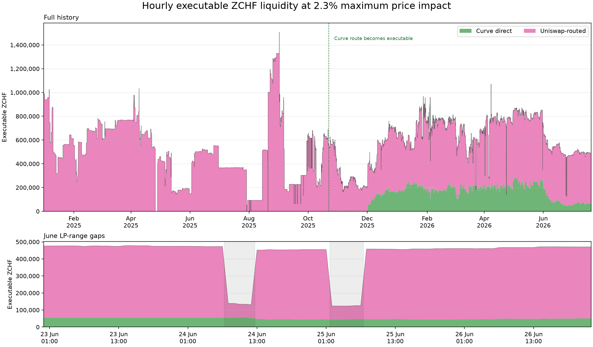

# ZCHF Borrow Cap

> **Initial borrow cap**
>
> **500,000 crvUSD**
>
> Based only on the 20 July 2026 Ethereum liquidity snapshot, assuming liquidity remains broadly stable.

## Price stress

| Measure | Decline | When |
|---|---:|---|
| ZCHF/crvUSD maximum high-to-low drawdown within 24 hours | 3.3672% | 2026-02-04 |
| CHF/USD maximum daily decline over the last 40 years | 7.8617% | 2011-09-05 to 2011-09-06 |
| Selected downside stress | 10.0% | Policy assumption |

We use a flat 10.0% stress, which is larger than the observed ZCHF drawdown and the 7.8617% historical CHF/USD decline. This provides an additional allowance for crypto depeg, oracle, and market-dislocation risks.

## Ethereum liquidity

We quoted the Ethereum [Curve ZCHF/crvUSD](https://etherscan.io/address/0x027B40F5917FCd0eac57d7015e120096A5F92ca9) direct pool and the [Uniswap ZCHF/USDT](https://etherscan.io/address/0x8E4318E2cb1ae291254B187001a59a1f8ac78cEF) → [Curve USDT/crvUSD](https://etherscan.io/address/0x390f3595bCa2Df7d23783dfd126427CCeb997BF4) routed path at [block 25,573,786](https://etherscan.io/block/25573786) to determine how much ZCHF can be swapped before average price impact reaches 2.3%, equal to the liquidation discount.

| Route | Path | Executable ZCHF | crvUSD out |
|---|---|---:|---:|
| Curve direct | ZCHF → Curve ZCHF/crvUSD → crvUSD | 66,226.35 | 80,220.38 |
| Uniswap-routed | ZCHF → Uniswap ZCHF/USDT → Curve USDT/crvUSD → crvUSD | 428,826.67 | 519,440.38 |
| **Combined disjoint capacity** | Both routes executed in parallel | **495,053.02** | **599,660.77** |

Executable ZCHF liquidity is the maximum ZCHF that can be sold through these routes without exceeding the 2.3% average price-impact limit; it is not pool TVL. Because the routes are disjoint, their capacities can be added: 66,226.35 + 428,826.67 = 495,053.02 ZCHF. The 20 July 2026 calculation assumes this liquidity will remain broadly stable. However, the contracted Uniswap market maker has withdrawn liquidity in the past. The Frankencoin team is aware of this and will monitor Ethereum liquidity.

*The green layer is the direct Curve route and the pink layer is the Uniswap-routed path. Because the routes share no pools, the stacked top is their usable combined capacity at a 2.3% maximum average price impact.*

The cap uses the 20 July 2026 Ethereum snapshot and divides its liquidity by 1.5; it does not use the historical minimum shown in the chart. The cap should be reviewed if Ethereum liquidity is withdrawn.

## Base liquidity

There is an Aerodrome Slipstream ZCHF/USDC concentrated-liquidity pool. It returns USDC, not crvUSD. Quotes include the 0.05% pool fee and are pinned to [Base block 49,261,853](https://basescan.org/block/49261853) at 2026-07-29 08:17:33 UTC.

| Quote | ZCHF in | USDC out | Average impact | Post-trade spot move |
|---|---:|---:|---:|---:|
| 2.3% marginal-price boundary | 365,403 | 442,922.862000 | 0.6554% | 2.3000% |

The 2.3% boundary applies to the post-trade spot move; the average price impact across the full trade is 0.6554%.

Base liquidity is not included in the borrow cap. Cross-chain arbitrage requires pre-positioned inventory or exposes arbitrageurs to bridge latency, inventory, and execution risk, and its availability during stress is unproven.

## CEX liquidity

On 2026-07-30, the [MEXC ZCHF/USDT market](https://www.mexc.com/exchange/ZCHF_USDT) had approximately 97,000 ZCHF of bid depth within 2% of the mid-price. This liquidity is not included in the borrow cap because exchange access, custody, transfer, fill, and inventory risks are not modeled.

Developing and validating a methodology for crediting Base or CEX liquidity is future work. Any defensible credit for those venues could support a higher cap.

## Borrow-cap calculation

Calculation settings:

- Amplification ($A$) = 180.
- Bands ($N$) = 4.
- Liquidation discount ($D_{\mathrm{liq}}$) = 2.3%.
- Maximum price impact ($\mathrm{PI}_{\max}$) = 2.3%.
- Loan discount ($D_{\mathrm{loan}}$) = 4.3%.
- Liquidity-contraction stress ($\lambda_{\mathrm{liq}}$) = 1.5×.
- Price shock ($s$) = 10.0%.
- Soft-liquidation efficiency ($\eta$) = 0%.
- Reference price ($P_0$) = 1.239822045 crvUSD/ZCHF, the fee-free pre-trade marginal price of the best selected route.
- Combined Ethereum executable liquidity ($x_{\mathrm{ETH}}^*$) = 495,053.02 ZCHF.
- Ethereum snapshot time = 2026-07-20 11:59:59 UTC.
- Ethereum snapshot block = 25,573,786.

$$
L=1-0.043-\frac{4}{2(180)}=0.945889
$$

$$
s_{\mathrm{trigger}}
=1-\frac{L}{1-0.023}
=0.031844,
\qquad
\phi=\frac{0.10-s_{\mathrm{trigger}}}{0.10}
=0.681565
$$

$$
K
=\frac{P_0(1-s)L}
{1.5(1-\eta)\phi}
=1.0323893695
\ \mathrm{crvUSD/ZCHF}
$$

$$
C_{\mathrm{ETH}}
=K(495{,}053.02)
=511{,}087.48\ \mathrm{crvUSD}
$$

| Liquidity source | Measured executable ZCHF liquidity | Stressed executable ZCHF liquidity (÷1.5) | Calculated cap |
|---|---:|---:|---:|
| Ethereum | 495,053.02 | 330,035.35 | 511,087.48 crvUSD |

The 1.5× liquidity-contraction stress is included in $K$: available Ethereum liquidity is divided by 1.5, reducing capacity from 495,053.02 to 330,035.35 ZCHF before calculating the cap. Base and CEX liquidity contribute 0 to this calculation.

## Decision

| Measure | Value |
|---|---:|
| Ethereum-only calculated cap | 511,087.48 crvUSD |
| **Initial suggested cap** | **500,000 crvUSD** |

The calculated cap already includes the 1.5× liquidity-contraction stress. At the 20 July 2026 snapshot, Ethereum liquidity supports 511,087.48 crvUSD, which is rounded down to an initial cap of 500,000 crvUSD. Base and CEX liquidity are disclosed but not credited.
