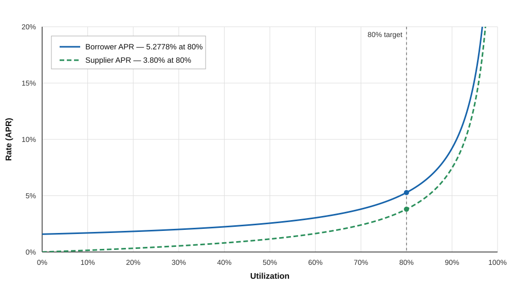

# ZCHF Monetary Policy

## Recommendation

Use Curve's fixed [`HyperbolicMP`](https://github.com/curvefi/curve-stablecoin/blob/70716d6868642956fa7dfd56c100274148fb0150/curve_stablecoin/mpolicies/v2/HyperbolicMP.vy):

- Target utilization = 80%
- Target supplier APR = 3.8%
- Target borrower APR = 5.2778%
- Low ratio = 0.3×
- High ratio = 10×
- Rate shift = 0%

## Contract configuration

Constructor order:

`HyperbolicMP(controller, target_utilization, target_rate, low_ratio, high_ratio, rate_shift)`

| Setting | Human value | Constructor value |
|---|---:|---:|
| Controller | Market controller | `<CONTROLLER_ADDRESS>` |
| Target utilization | 80% | `800000000000000000` |
| Target borrower APR | 5.2778% | `1673572355` per second |
| Low ratio | 0.3× target rate at 0% utilization | `300000000000000000` |
| High ratio | 10× target rate at 100% utilization | `10000000000000000000` |
| Rate shift | 0% | `0` |

The 0.3× low ratio supports supplier yield at moderate utilization while keeping underused-market borrowing relatively inexpensive. The 10× high ratio increases rates sharply as available liquidity is exhausted.

## Rate curve

The chart is capped at 20% APR; higher rates are shown in the table below.

| Utilization | Borrower APR | Supplier APR |
|---:|---:|---:|
| 0% | 1.5833% | 0.0000% |
| 25% | 1.9130% | 0.4304% |
| 50% | 2.5598% | 1.1519% |
| 70% | 3.8052% | 2.3973% |
| 80% | 5.2778% | 3.8000% |
| 85% | 6.6643% | 5.0982% |
| 90% | 9.2080% | 7.4585% |
| 95% | 15.3944% | 13.1622% |
| 99% | 35.2754% | 31.4304% |
| 100% | 52.7778% | 47.5000% |
